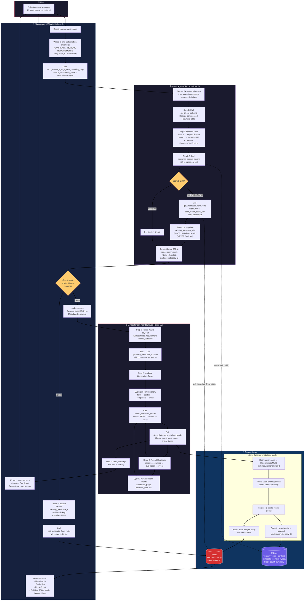
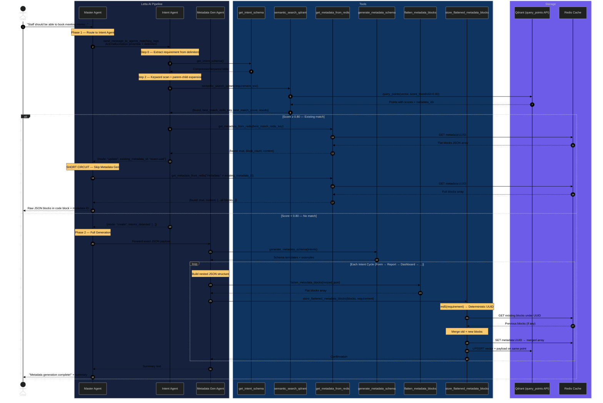

# Creviz AI Metadata Generation Pipeline

This repository contains the architecture, internal agent prompts, and tool scripts that power the Creviz Multi-Agent Metadata Generation Pipeline using [Letta AI](https://letta.com/).

## 🏗️ End-to-End System Flow



## 🧠 How it Works Behind the Scenes



## 🚀 How to Run the Environment

### 1. Start Qdrant Vector Database
Run Qdrant via the executable in your environment:
```powershell
C:\Users\prads\OneDrive\Desktop\qdrant\qdrant.exe
```
This runs the vector DB at `http://localhost:6333` which handles our semantic search indexing.

### 2. Start the Letta Server
In your Letta project directory, start the server using `uv`:
```powershell
uv run letta server
```
This boots the Letta runtime at `http://localhost:8283`.

### 3. Check Database Outputs
We use `check_db.py` to view exactly what is stored in both Redis and Qdrant at any given time.
```powershell
uv run python check_db.py
```

### 📊 Sample Output from `check_db.py`

When metadata generation is successfully completed, you will see output grouping all modular blocks properly flattened into array entries in Redis, mapping to exactly one semantic point in Qdrant:

```text
============================================================
REDIS DATA
============================================================
Total keys: 3

Key: metadata:0f39c566-09d7-8cf7-ef3d-7f6186d77329
Format: FLAT BLOCKS (10 blocks)

  --- Block 1: section ---
  {
    "id": "7dc1a92e-3363-44eb-b59a-14d2e1fd4eec",
    "type": "card",
    ...
  }

  --- Block 2: component ---
  {
    "id": "e479c72e-d01d-44a6-9c4c-47fc9aa9882a",
    "name": "prospectName",
    ...
  }
------------------------------------------------------------

============================================================
QDRANT DATA
============================================================
Total points: 3

Point ID: 7363032332737684558
  metadata_id : aa4b2fdb-2dbc-9e0c-6ad3-5e37d40bca1c
  intent_type : action
  types_stored: action, business_rule, component, event, form, section
  block_count : 37
  summary     : Employees need a way to request corporate travel. They should specify their destination...
------------------------------------------------------------
```
